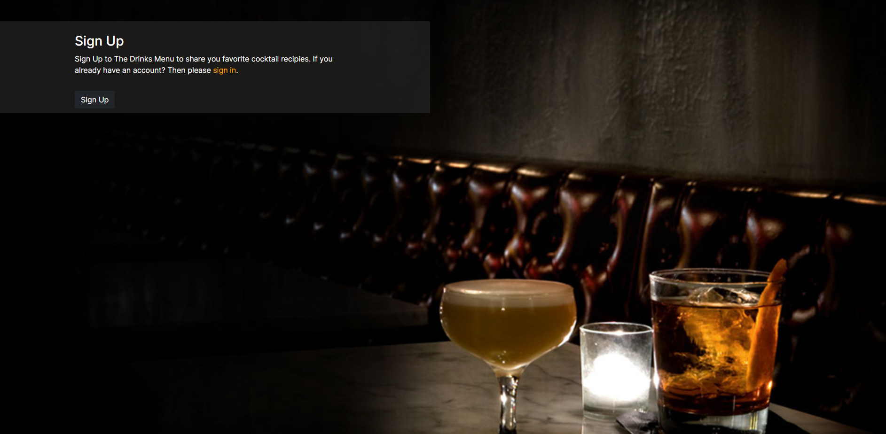
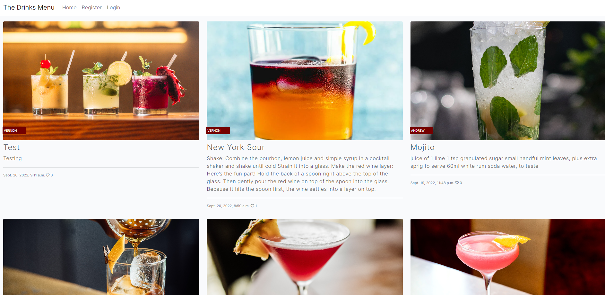
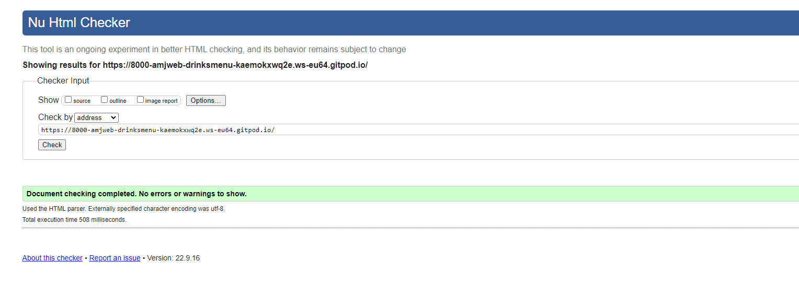
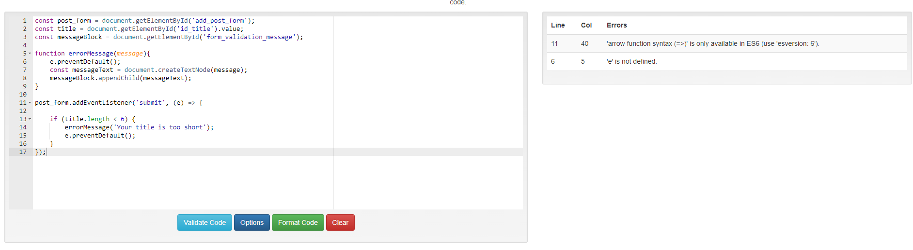
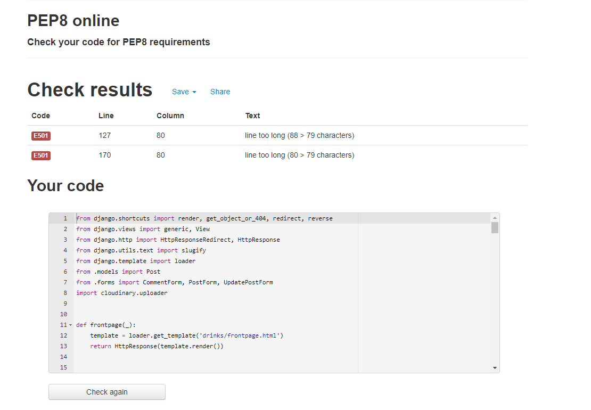
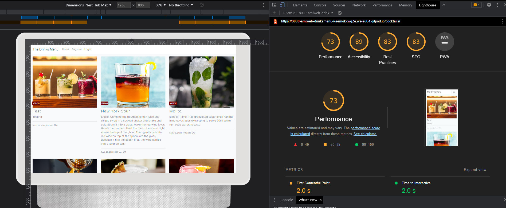

# The Drinks Menu

The Drinks Menu is a place for visitors to find and share cocktail recipes. Users are able to register an account, then share and mange their own cocktail recipes. 
## Installation

Here is a [link](https://drinks-menu.herokuapp.com/) to the deployed app. 

## Project Overview

The Drinks Menu is built using **Pyhton, PostGresSQL, Bootstrap, Javascript and Django** the images are being managed by **Cloudinary.** 

## User Stories
**First-Time Visitor Goals - As a first-time user, who has not created an account, I want to be able to:**
* Understand what the purpose of the application is and how to use it.  
* View the recipes
* Create an account

**Registered User Goals - As a registered user I want to be able to:**
* Create, Edit and delete my own cocktail recipes
* View the recipes
* Create an account
* Upload an image of my cocktail
* Comment on other user's recipes

**Site Admin Goals - As an administrator, I want to be able to:**
* Create, Edit and delete my own and users cocktail recipes
* Manage and authenticate user's posts and comments

## Design

I wanted the home page to be dark and atmospheric to try and replicate walking into a swanky cocktail bar. 
In contrast the drinks page is light. I want the pictures of the cocktails to be the first thing that catches the users eye. I feel that it also encourages the user
to take and/or post beautiful pictures of their own cocktails. 

I chose to use Inter font from [Google Fonts](https://fonts.google.com/specimen/Inter) as it is easy to read while having a modern sleek look. 

**Wireframes**

* [Home Page](static/images/home-wf.png)
* [Register Page](static/images/register-wf.png)
* [Drinks Page](static/images/drinks-wf.png)
* [Create New Post](static/images/create-new-wf.png)
* [Edit Post](static/images/edit-wf.png)
* [Mobile Home Page](static/images/home-phone-wf.png)
* [Mobile Drinks Page](static/images/drinks-phone-wf.png)
* [Mobile New Post](static/images/new-post-phone-wf.png)
* [Mobile Register](static/images/register-phone-wf.png)
* [Mobie Sign In](static/images/sign-in-phone-wf.png)

## Functionality Requirments 
* Full CRUD functionality
* Intuitive navigation
* Responsive to different screen sizes [Link](http://www.responsinator.com/?url=https%3A%2F%2F8000-amjweb-drinksmenu-kaemokxwq2e.ws-eu64.gitpod.io%2Fcocktails%2F)

## Errors
* The welcome message next to the add post button is no needed and in the wrong place.
* The text size changes on the log in page.  
* There are probably MANY more, time was huge issue for me in this project after a lengthy leave of abscence.

## Testing
**HTML**

**CSS**

    

            

**JS**
JS threw up an error for 'e' not being defined but as it is parsed through the DOMS I feel it is safe to ignore this. 

**Python**
Lines are too long are the only errors when running a PEP-8 check. I don't think this should be an error. 

**Lighthouse**
70+ on all scores in Lighthouse isn't the best, but acceptable.....I hope. 

**Responsive Design**
Responsive to different screen sizes [Link](http://www.responsinator.com/?url=https%3A%2F%2F8000-amjweb-drinksmenu-kaemokxwq2e.ws-eu70.gitpod.io%2F)

## Manual Testing
**First-Time Visitor Goals - As a first-time user, who has not created an account, I want to be able to understand what the purpose of the application is and how to use it.**
* [Home Page](static/images/frontpage.png)

**View the recipies**
* [Drinks Page](static/images/Drinkspage.png)

**Create an account**
* [Register Page](static/images/register-page.png)

**As a registered user I want to be able to Create, Edit and delete my own cocktail recipes**
* [New Post Page](static/images/new-post.png)
* [edit delte buttons](static/images/edit-delete.png)
* [edit post page](static/images/edit-post.png)

**View the recipes**
* [Drinks Page](static/images/Drinkspage.png)

**Create an account**
* [Register Page](static/images/register-page.png)

**Upload an image of my cocktail**
* [upload image](static/images/upload-image.png)

**Comment on other user's recipes**
* [comment Page](static/images/commnet-done.png)

**Site Admin Goals - As an administrator, I want to be able to Create, Edit and delete my own and users cocktail recipes**
* [Admin cocktails](static/images/admin-cocktails.png)

**Manage and authenticate user's posts and comments**
* [Admin cocktails](static/images/manage-comment.png)

## Documentation used

**Django**
- https://docs.djangoproject.com/en/4.1/

**Create Post**
-   https://stackoverflow.com/questions/6253611/how-to-get-the-id-of-a-just-created-record-in-django

**Update Post**

-   https://www.geeksforgeeks.org/update-view-function-based-views-django/
-   https://docs.djangoproject.com/en/4.1/topics/class-based-views/intro/

**Image Upload to Cloudinary**

-   https://docs.djangoproject.com/en/4.1/topics/http/file-uploads/
-   https://cloudinary.com/documentation/django_integration
-   https://cloudinary.com/documentation/django_image_and_video_upload
-   https://stackoverflow.com/questions/33003173/linking-a-cloudinary-image-upload-to-a-django-model-field

**Capturing URL parameters**
- https://stackoverflow.com/questions/150505/capturing-url-parameters-in-request-get

**General Fixes**
-   https://stackoverflow.com/questions/4642596/how-do-i-check-whether-this-user-is-anonymous-or-actually-a-user-on-my-system
-   https://stackoverflow.com/questions/57674348/typeerror-post-got-an-unexpected-keyword-argument

**Bootstrap Alerts**
- https://getbootstrap.com/docs/4.0/components/alerts/

**Getting Images same height**

-   https://stackoverflow.com/questions/37287153/how-to-get-images-in-bootstraps-card-to-be-the-same-height-width

## Acknowledgements

* Most of the picture were taken from [unsplash.com](https://unsplash.com/)
* All of the recipies are from [bbcgoodfood.com](https://www.bbcgoodfood.com/)

**The enitire project is heavily based on the code along tutorial "I think therefore I blog" from [The Code Insitute](https://codeinstitute.net/full-stack-software-development-diploma/?utm_term=the%20code%20institute&utm_campaign=CI+-+UK+-+Search+-+Brand&utm_source=adwords&utm_medium=ppc&hsa_acc=8983321581&hsa_cam=1578649861&hsa_grp=62188641240&hsa_ad=581730217381&hsa_src=g&hsa_tgt=kwd-572567981978&hsa_kw=the%20code%20institute&hsa_mt=e&hsa_net=adwords&hsa_ver=3&gclid=CjwKCAjwyaWZBhBGEiwACslQo-MjHk10r88-t4IPQa_EDUihpydmI6C5nLpOwKQydYkoDnId_dncuhoCP_UQAvD_BwE). Without their course material and their EXCELLENT tutors I would never have been able to complete this project**

## Fixes and Changes to make in the future

- The general UI and sytling of the site isn't quiet what I want it to be but I ran out of time. 
    it is not the easiest site for a user to use and I will correct this after reciving my assesment results, pass or fail.
- I would like to add a search bar and imnprove the sites pagination
- More functionality for the user to manage their own account is need. Password changing, email notifications for a start.  

